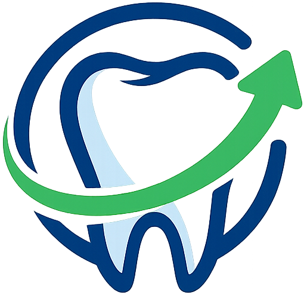

<div align="center">



# DentalReativa

**Reative pacientes inativos com 1 clique pelo WhatsApp.**

SaaS para clínicas odontológicas brasileiras que automatiza o processo de recontato com pacientes que pararam de aparecer — sem API paga, sem burocracia.

[](https://nextjs.org/)
[](https://www.typescriptlang.org/)
[](https://www.postgresql.org/)
[](https://tailwindcss.com/)

</div>

---

## O problema que resolve

Clínicas odontológicas perdem em média **25% dos pacientes por ano**. Esses pacientes simplesmente somem — não cancelam, não avisam, apenas param de aparecer.

Softwares como o Dental Office lembram quem **tem** consulta marcada. O DentalReativa traz de volta quem **sumiu**.

---

## Funcionalidades

| Tela | O que faz |
|------|-----------|
| **Dashboard** | Visão geral de pacientes em risco, receita recuperável e evolução mensal |
| **Pacientes** | Cadastro manual, importação CSV/Excel, filtros, busca e histórico |
| **Central de Envios** | Fila de recontato com envio via WhatsApp em 1 clique |
| **Relatórios** | Funil de reativação, receita recuperada e taxa de sucesso |
| **Configurações** | Dados da clínica e modelos de mensagem personalizáveis |

### Destaques técnicos

- **Sem API oficial do WhatsApp** — usa `wa.me`, sem custo por mensagem e sem aprovação do Meta
- **3 tentativas de contato** — cada uma com mensagem e tom diferentes, configuráveis pela clínica
- **Importação inteligente** — aceita CSV e Excel com datas em 6+ formatos diferentes
- **Lógica de risco automática** — classifica pacientes por dias sem consulta (médio / alto / crítico)

---

## Stack

| Camada | Tecnologia |
|--------|------------|
| Framework | Next.js 16 — App Router |
| Linguagem | TypeScript |
| Estilização | Tailwind CSS + shadcn/ui |
| Banco de dados | PostgreSQL |
| ORM / Query | node-postgres (`pg`) |
| Autenticação | NextAuth.js — Credentials Provider |

---

## Estrutura do projeto

```
dentalreativa/
├── app/
│   ├── api/                    # Rotas da API
│   │   ├── auth/               # NextAuth
│   │   ├── clinica/            # CRUD da clínica
│   │   ├── pacientes/          # CRUD + importação + fila
│   │   ├── envios/             # Registro de envios e ações
│   │   ├── mensagens/          # Modelos de mensagem
│   │   ├── relatorios/         # Dados dos relatórios
│   │   └── notificacoes/       # Notificações do sino
│   ├── dashboard/
│   │   ├── page.tsx            # Dashboard principal
│   │   ├── automacao/          # Central de Envios
│   │   ├── pacientes/          # Lista de pacientes
│   │   ├── relatorios/         # Relatórios
│   │   └── configuracoes/      # Configurações
│   └── page.tsx                # Login + cadastro
├── components/
│   └── ui/                     # shadcn/ui components
└── lib/
    ├── db.ts                   # Conexão com o banco
    ├── calcularRisco.ts        # Lógica de nível de risco
    ├── formatarTelefone.ts     # Validação e formatação
    └── parsearArquivoPacientes.ts  # Parser CSV/Excel
```

---

## Regras do banco

```sql
-- Nomes de colunas são camelCase com aspas duplas obrigatórias
SELECT p."ultimaConsulta", p."dadosIncompletos" FROM "Paciente" p

-- Cast de ENUM sempre com ::text primeiro
WHERE status = 'contatado'::text::"StatusPaciente"

-- COUNT retorna string — sempre converter
parseInt(result.rows[0].total)
```

**Valores do ENUM `StatusPaciente`:**
`ativo` · `contatado` · `aguardando_resposta` · `recuperado` · `nao_contatar`

---

## Lógica de risco

| Dias sem consulta | Nível |
|-------------------|-------|
| Menos de 180 dias | `ok` — não entra na fila |
| 180 a 269 dias | `medio` |
| 270 a 364 dias | `alto` |
| 365 dias ou mais | `critico` |

---

## Licença

Proprietário — todos os direitos reservados © 2026 DentalReativa