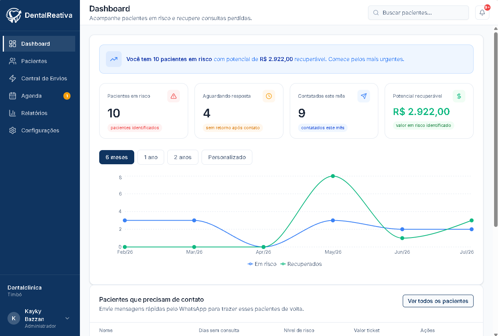
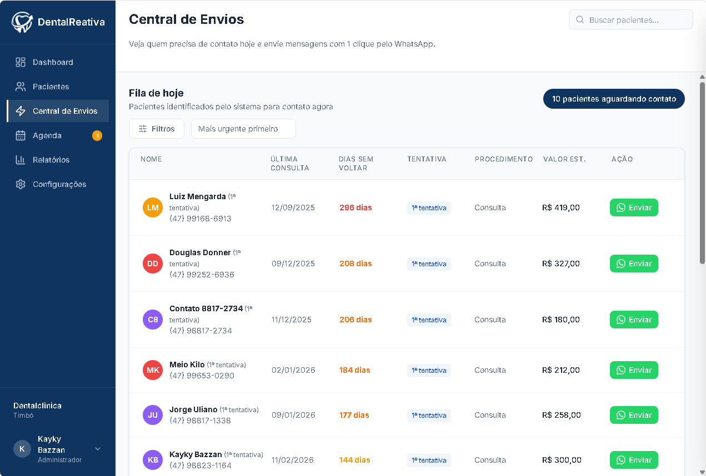
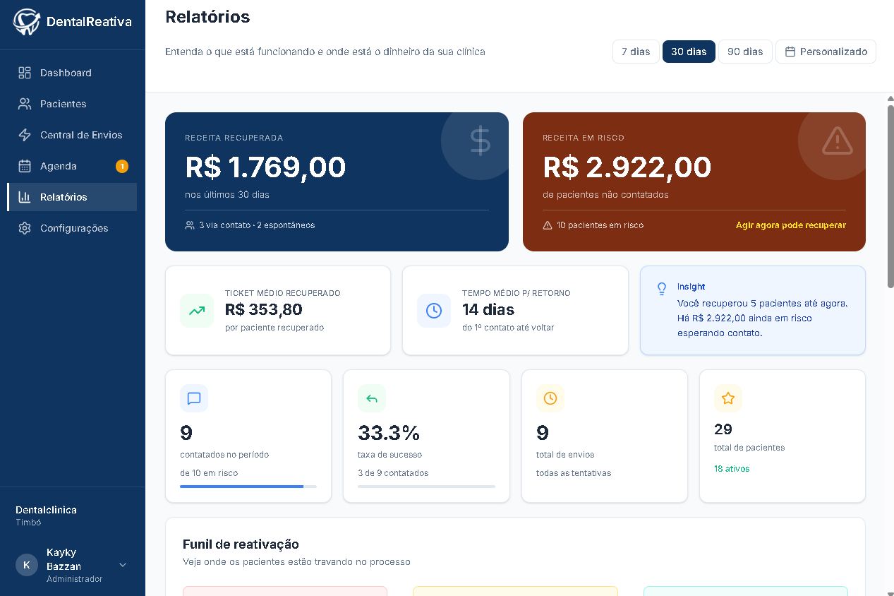

<div align="center">


# DentalReativa

**Reative pacientes inativos com 1 clique pelo WhatsApp.**

SaaS para clínicas odontológicas brasileiras que automatiza o processo de recontato com pacientes que pararam de aparecer — sem API paga, sem burocracia.


**[🔗 Ver demo ao vivo](https://dentalreativa.vercel.app/)**

</div>

---

## Demonstração

**Dashboard** — visão geral de pacientes em risco e receita recuperável


**Central de Envios** — fila priorizada com envio via WhatsApp em 1 clique


**Relatórios** — funil de reativação e receita recuperada


## O problema que resolve

Clínicas odontológicas perdem em média **25% dos pacientes por ano**. Esses pacientes simplesmente somem — não cancelam, não avisam, apenas param de aparecer.

Softwares como o Dental Office e o Easy Dental lembram quem **tem** consulta marcada. O DentalReativa não compete com eles — é uma camada complementar que identifica e traz de volta quem **sumiu**.

## Funcionalidades

| Tela | O que faz |
|---|---|
| **Dashboard** | Visão geral de pacientes em risco, receita recuperável e evolução mensal |
| **Pacientes** | Cadastro manual, importação CSV/Excel, filtros, busca e histórico |
| **Central de Envios** | Fila de recontato priorizada, com envio via WhatsApp em 1 clique |
| **Agenda** | Fila de follow-up de reativação (não é agenda de consultas — é "quem eu preciso contatar essa semana") |
| **Relatórios** | Funil de reativação, receita recuperada e taxa de sucesso por tentativa |
| **Configurações** | Dados da clínica, modelos de mensagem e limites de risco personalizáveis |

## Destaques técnicos

- **Sem API oficial do WhatsApp no MVP** — usa `wa.me` para validar o produto sem custo por mensagem antes de investir na WhatsApp Cloud API (Meta) na fase paga
- **3 tentativas de contato** — cada uma com mensagem e intervalo configuráveis pela clínica
- **Importação inteligente** — aceita CSV e Excel com datas em múltiplos formatos, normalizando fuso horário para evitar erros de "um dia a menos"
- **Lógica de risco configurável** — classifica pacientes por dias sem consulta (médio / alto / crítico), com limites ajustáveis por clínica

## Stack

| Camada | Tecnologia |
|---|---|
| Framework | Next.js 16.2 — App Router |
| UI | React 19.2 |
| Linguagem | TypeScript 5.7 |
| Estilização | Tailwind CSS 4.2 + shadcn/ui (Radix UI) |
| Banco de dados | PostgreSQL (Neon, serverless) |
| Cliente SQL | node-postgres (`pg`) — queries SQL diretas, sem ORM |
| Autenticação | NextAuth.js 4 — Credentials Provider + bcryptjs |
| Formulários / validação | React Hook Form + Zod |
| Importação de planilhas | SheetJS (`xlsx`) |
| Gráficos | Recharts |
| Deploy | Vercel |

## Estrutura do projeto

```
dentalreativa/
├── app/
│   ├── api/                    # Rotas da API
│   │   ├── auth/               # NextAuth
│   │   ├── clinica/            # CRUD da clínica
│   │   ├── pacientes/          # CRUD + importação + fila
│   │   ├── envios/             # Registro de envios e ações
│   │   ├── agendamentos/       # Fila de follow-up (Agenda)
│   │   ├── mensagens/          # Modelos de mensagem
│   │   ├── relatorios/         # Dados dos relatórios
│   │   └── notificacoes/       # Notificações do sino
│   ├── dashboard/
│   │   ├── page.tsx            # Dashboard principal
│   │   ├── automacao/          # Central de Envios
│   │   ├── pacientes/          # Lista de pacientes
│   │   ├── agenda/             # Fila de reativação
│   │   ├── relatorios/         # Relatórios
│   │   └── configuracoes/      # Configurações
│   └── page.tsx                # Login + cadastro
├── components/
│   └── ui/                     # Componentes shadcn/ui
└── lib/
    ├── db.ts                   # Conexão com o banco (pg Pool)
    ├── calcularRisco.ts        # Lógica de nível de risco
    ├── formatarTelefone.ts     # Validação e formatação de telefone
    └── parsearArquivoPacientes.ts  # Parser CSV/Excel
```

## Como rodar localmente

**Pré-requisitos:** Node.js 20+, uma instância PostgreSQL (recomendado: [Neon](https://neon.tech), plano gratuito).

```bash
# 1. Clonar o repositório
git clone https://github.com/<seu-usuario>/dentalreativa.git
cd dentalreativa

# 2. Instalar dependências
npm install

# 3. Configurar variáveis de ambiente
cp .env.example .env.local
# preencha o .env.local com seus próprios valores (veja abaixo)

# 4. Rodar em desenvolvimento
npm run dev
```

Abra [http://localhost:3000](http://localhost:3000).

### Variáveis de ambiente

Crie um arquivo `.env.local` na raiz com:

```dotenv
DATABASE_URL=            # string de conexão do PostgreSQL (Neon)
NEXTAUTH_SECRET=         # string aleatória para assinar sessões (gere com: openssl rand -base64 32)
NEXTAUTH_URL=            # URL da aplicação (http://localhost:3000 em dev)
CRON_SECRET=             # token usado para autenticar a rotina agendada (Vercel Cron)
```

> ⚠️ Nunca commite o `.env.local` — confirme que ele está no `.gitignore`.

## Convenções de banco de dados

Notas de engenharia para quem for mexer nas queries diretas em SQL:

```sql
-- Colunas em camelCase exigem aspas duplas
SELECT p."ultimaConsulta", p."dadosIncompletos" FROM "Paciente" p;

-- Cast de ENUM: sempre passar por ::text antes do tipo customizado
-- (evita falha silenciosa de binding com a lib `pg`)
WHERE status::text = 'contatado'::text::"StatusPaciente";
```

```ts
// COUNT(*) do Postgres retorna string — sempre converter
const total = parseInt(result.rows[0].total);
```

**Valores do ENUM `StatusPaciente`:** `ativo` · `contatado` · `aguardando_resposta` · `recuperado` · `nao_contatar`

## Lógica de risco

| Dias sem consulta | Nível |
|---|---|
| Menos de 180 dias | OK — não entra na fila |
| 180 a 269 dias | Médio |
| 270 a 364 dias | Alto |
| 365 dias ou mais | Crítico |

Os limites de dias são configuráveis por clínica em Configurações.

## Status do projeto

🚧 **MVP em desenvolvimento ativo.** Frontend e backend (autenticação, banco de dados, CRUD de pacientes) funcionais e em produção. Envio de mensagens é manual via `wa.me`; automação de envio real (WhatsApp Cloud API) está no roadmap para quando houver receita para sustentar o custo por mensagem.

**Próximos passos:**
- [ ] Tela de perfil individual do paciente (timeline clínica + timeline de contatos)
- [ ] Integração com WhatsApp Cloud API (Meta) como upgrade pago
- [ ] Métricas de performance de mensagens com estado vazio tratado

## Autor

**Kayky Bazzan**
[LinkedIn](https://www.linkedin.com/in/kaykybazzan)

## Licença

Proprietário — todos os direitos reservados © 2026 DentalReativa